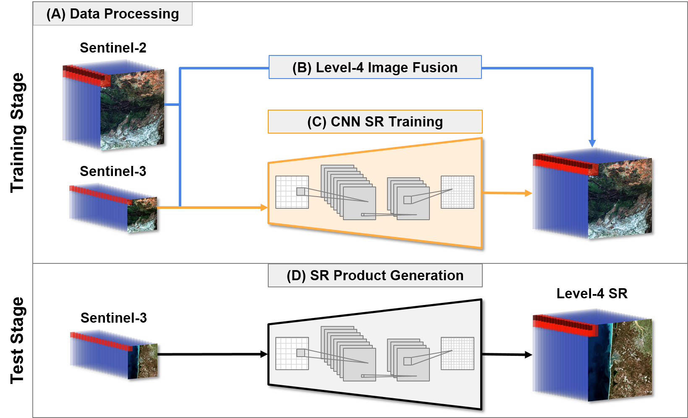
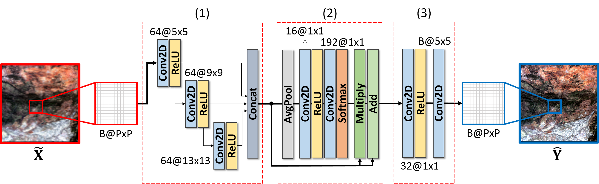

# Sentinel-3 Super-Resolution based on Dense Multi-Receptive Channel Attention

[Rafael Fernandez](https://ieeexplore.ieee.org/author/37088757738), [Ruben Fernandez-Beltran](https://scholar.google.es/citations?user=pdzJmcQAAAAJ&hl=es), [Jian Kang](https://github.com/jiankang1991), [Filiberto Pla](https://scholar.google.es/citations?user=mSSPcAMAAAAJ&hl=es)
---

This repo contains the codes for the JSTARS paper: [Sentinel-3 Super-Resolution based on Dense Multi-Receptive Channel Attention](https://ieeexplore.ieee.org/stamp/stamp.jsp?tp=&arnumber=9488297). The unprecedented availability of remote sensing data from different complementary Sentinel missions provides increasing opportunities to alleviate the spatial limitations of Sentinel-3 (S3) from an inter-sensor perspective. Nonetheless, effectively exploiting such inter-sensor synergies still raises important challenges for super-resolution (SR) algorithms in terms of operational data availability, sensor alignment and substantial resolution changes, among others. In this scenario, this paper sets a new SR framework for spatially enhancing S3 Ocean and Land Colour Instrument (OLCI) products by taking advantage of the higher spatial resolution of the Sentinel-2 (S2) Multi-Spectral Instrument (MSI). To achieve this goal, we initially study some of the most important deep learning-based approaches. Then, we define a novel Level-4 SR framework which integrates a new convolutional neural network (CNN) specially designed for super-resolving OLCI data. In contrast to other networks, the proposed SR architecture (termed as SRS3) employs a dense multi-receptive field together with a residual channel attention mechanism to relieve the particularly low spatial resolution of OLCI while extracting more discriminating features for the large spatial resolution differences with respect to MSI. The experimental part of the work, conducted using ten coupled OLCI and MSI operational data, reveals the suitability of the presented Level-4 SR framework within the Copernicus programme context as well as the advantages of the proposed architecture with respect different state-of-the-art models when spatially enhancing OLCI products.






## Usage

(comming soon)

<!-- `./codes/create_model_regression.m` is the proposed 3D-CNN. -->

<!-- `./codes/RUN_3dcnn.m` is a sample of the main script. -->


## Citation

```
@article{fernandez2021sentinel,
  title={Sentinel-3 Super-Resolution based on Dense Multi-Receptive Channel Attention},
  author={Fernandez, Rafael and Fernandez-Beltran, Ruben and Kang, Jian and Pla, Filiberto},
  journal={IEEE Journal of Selected Topics in Applied Earth Observations and Remote Sensing},
  volume={},
  pages={--},
  year={2021},
  publisher={IEEE},
  doi={10.1109/JSTARS.2021.3097410}
}
```


## References

[1] Dong, C., Loy, C. C., He, K., & Tang, X. (2015). Image super-resolution using deep convolutional networks. IEEE transactions on pattern analysis and machine intelligence, 38(2), 295-307.

[2] Zhang, Y., Li, K., Li, K., Wang, L., Zhong, B., & Fu, Y. (2018). Image super-resolution using very deep residual channel attention networks. In Proceedings of the European conference on computer vision (ECCV) (pp. 286-301).
